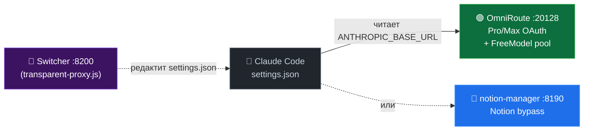
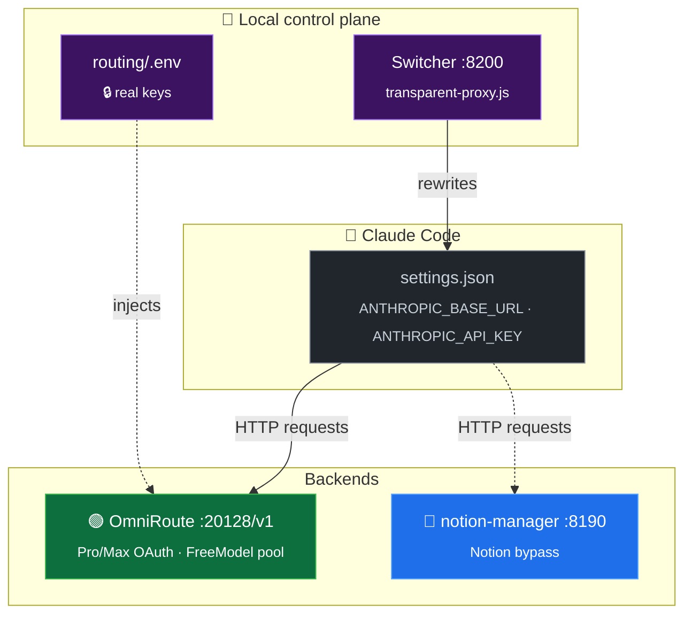

<div align="center">

# 🎛️ Vibe-Code Account Creator Manager

**Полный тулкит для управления Devin · Notion · FreeModel аккаунтами**
**+ локальный роутер бэкендов для Claude Code (OmniRoute ↔ notion-manager)**

<p>
  
  
  
  
</p>

<sub>🤖 Devin · 📝 Notion · 🆓 FreeModel · 🔀 Routing dashboard</sub>

</div>

---

## 📦 Что внутри

Три независимых саб-системы под одной крышей:

<table>
<tr>
  <th width="22%">Саб-система</th>
  <th width="50%">Что делает</th>
  <th width="28%">Где живёт</th>
</tr>
<tr>
  <td>🤖 <b>Devin</b> автореги</td>
  <td>Создаёт Pro-аккаунты devin.ai с картой/прокси/локалью</td>
  <td><code>autoreger.js</code> · <code>internal/</code> · <code>menu.js</code></td>
</tr>
<tr>
  <td>📝 <b>Notion</b> автореги</td>
  <td>Создаёт Notion-аккаунты, привязывает карту, фиксит trial</td>
  <td><code>notion/</code> · <code>notion_workflow.js</code></td>
</tr>
<tr>
  <td>🆓 <b>FreeModel</b> сессии</td>
  <td>Менеджит сессии freemodel.dev (Claude через клуб)</td>
  <td><code>freemodel/</code> · <code>manual_sessions/</code></td>
</tr>
<tr>
  <td>🔀 <b>Routing dashboard</b></td>
  <td>Web-UI на <code>:8200</code> — переключатель backend для Claude Code + менеджер всех 3х систем</td>
  <td><code>routing/</code> · <code>internal/dashboard-api.js</code></td>
</tr>
</table>

---

## 🚀 Быстрый старт

```bash
# 1. Зависимости
npm install
npx playwright install chromium

# 2. Конфиг
cp routing/.env.example routing/.env
# → заполни OMNIROUTE_API_KEY и NOTION_API_KEY

# 3. Запуск дашборда
routing\restart-dashboard.bat     # Windows: один клик
# или: node routing/transparent-proxy.js

# → откроется http://localhost:8200/__switch
```

> [!TIP]
> Альтернатива — классическое TUI меню: `node menu.js`

---

## 🖥 Routing dashboard

Открой `http://localhost:8200/__switch` — четыре вкладки в сайдбаре.

### 🔀 Switcher — переключатель бэкендов

Переключает Claude Code между двумя бэкендами одним кликом:



<table>
<tr>
  <th>🟢 FreeModel</th>
  <th>🔵 Notion</th>
</tr>
<tr>
  <td>
    <code>tools / vision / big</code><br>
    OmniRoute <code>:20128</code>
  </td>
  <td>
    <code>cheap, без tools</code><br>
    notion-mgr <code>:8190</code>
  </td>
</tr>
</table>

Клик переписывает `~/.claude/settings.json` (с `.bak-<timestamp>` бэкапом) — после нужно **перезапустить Claude Code**.

> [!IMPORTANT]
> CC принимает в `settings.json` **только** ключ `sk-local-dev-key` (внутренний bypass-токен OmniRoute) — любой другой даёт «Not logged in · Please run /login». Реальные API-ключи живут в `routing/.env` (gitignored), их подставляет роутер.

**Whoami** — вставляешь ID из лога OmniRoute (`anthropic-compatible-...:fd48f370-...`), показывает кто это (email/name/status) из локальной БД OmniRoute.

### 🤖 Devin · 🆓 FreeModel · 📝 Notion — менеджер сессий

Список сессий с **прогресс-барами квот** и действиями на каждой строке:

<table>
<tr><th>Цвет</th><th>Квота использована</th></tr>
<tr><td>🟢</td><td>&lt; 40%</td></tr>
<tr><td>🟡</td><td>40 – 70%</td></tr>
<tr><td>🔴</td><td>&gt; 70%</td></tr>
</table>

<table>
<tr><th>Кнопка</th><th>Действие</th></tr>
<tr><td>🌐</td><td>Открыть в headed Chrome (Notion.so / app.devin.ai/settings/usage / claude.ai/usage)</td></tr>
<tr><td>🔄</td><td>Обновить квоту через headless Playwright (~1–3s)</td></tr>
<tr><td>➕</td><td>Создать новую сессию (запускает <code>node ...</code> в новом окне cmd)</td></tr>
<tr><td>🗑</td><td>Удалить папку сессии + кеш</td></tr>
</table>

**Сортировка:** дата ↑/↓ · статус · план Pro→Free · квота (меньше/больше использовано) · доступно $ · свежесть кеша · email.

### 💳 Card picker (Notion)

3 карты-пресета (`CARD_PRESETS` из `notion/config.js`) + опция «🔄 Ротация». Клик — обновляется `CARD_PRESET_INDEX` через regex-replace в `notion/config.js`, без рестарта.

---

## 🏗 Архитектура роутинга



---

## 📜 Скрипты

<details>
<summary><b>🧭 Главное меню</b></summary>

```bash
node menu.js               # Полное интерактивное TUI меню
```
</details>

<details>
<summary><b>🤖 Devin</b></summary>

```bash
node autoreger.js                  # Прямой запуск создания аккаунтов
node internal/bin-lookup.js        # BIN-генератор (148 BIN, 12 стран)
```
</details>

<details>
<summary><b>📝 Notion</b></summary>

```bash
node notion/notion_workflow.js     # Создать Notion-аккаунт (с картой)
```
</details>

<details>
<summary><b>🆓 FreeModel</b></summary>

```bash
node freemodel/freemodel_autoreger_v3.js          # Автореги (instanttempemail)
node freemodel/freemodel_autoreger_v3.js 5        # 5 аккаунтов подряд
node freemodel/freemodel_autoreger_v3.js 5 FRE-x  # Override стартового инвайта

node freemodel/create_first_session.js   # Логин + сохранение сессии
node freemodel/login_and_save_session.js # Альтернативный вход
node freemodel/restore_session.js        # Восстановить из cookies
```
</details>

<details>
<summary><b>🔀 Routing</b></summary>

```bash
routing\restart-dashboard.bat            # Перезапуск :8200 (Windows)
routing\PANIC-restore-omniroute.bat      # Откат settings.json на OmniRoute
node routing/transparent-proxy.js        # Switcher вручную
node routing/smart-router-v3.js          # Auto-router :8201 (экспериментальный)
```
</details>

---

## ⚙ Конфигурация

| Файл | Что настраивает |
|---|---|
| `config.js` | Devin: BINs · proxy · billing · headless · sound · timing |
| `notion/config.js` | Notion: CARD_PRESETS · CARD_PRESET_INDEX · proxy · viewport |
| `freemodel/config.js` | FreeModel: URLs · паттерны email · таймауты |
| `routing/.env` | 🔒 **Секреты** (gitignored): `OMNIROUTE_API_KEY`, `NOTION_API_KEY` |
| `~/.claude/settings.json` | Активный backend (Switcher редактирует) |

---

## 🗂 Структура

```
.
├── routing/                      # 🆕 Web-дашборд + локальные роутеры
│   ├── transparent-proxy.js      # Switcher на :8200 + HTTP API дашборда
│   ├── proxy-dashboard.html      # Tailwind v4 UI (OKLCH палитра, Geist)
│   ├── smart-router-v3.js        # Авто-роутер :8201 (по telu запроса)
│   ├── restart-dashboard.bat     # One-click рестарт
│   ├── PANIC-restore-omni…       # Откат settings.json
│   ├── .env                      # 🔒 gitignored — реальные ключи
│   └── .env.example              # template
│
├── internal/
│   ├── dashboard-api.js          # Чистая прослойка CLI ↔ HTTP
│   ├── devin-manager.js          # Devin сессии (manual + ready + errors)
│   ├── freemodel-manager.js      # FreeModel сессии + квоты
│   ├── notion-manager.js         # Notion сессии
│   ├── autoreger.js              # Логика создания Devin-аккаунтов
│   └── bin-lookup.js             # БД BIN + Luhn генератор
│
├── notion/                       # Notion autoreg
│   ├── notion_workflow.js
│   ├── config.js                 # CARD_PRESETS, CARD_PRESET_INDEX
│   └── sessions/                 # 🔒 gitignored
│
├── freemodel/                    # FreeModel
│   ├── create_first_session.js
│   ├── freemodel_autoreger_v3.js
│   ├── .last_invite              # Указатель реф-цепочки
│   └── sessions/                 # 🔒 gitignored
│
├── manual_sessions/              # 🔒 Devin + FreeModel сессии
├── ready_to_sell/                # 🔒 Готовые Pro-сессии Devin
├── errors/                       # 🔒 Не-успешные попытки
│
├── menu.js                       # 1600-строчное TUI меню (всё-в-одном)
├── autoreger.js                  # Главный entry point Devin
├── start.js                      # Альтернативный entry с CLI-аргументами
└── config.js                     # Корневой конфиг (Devin)
```

> 🔒 = в `.gitignore`, не в репозитории.

---

## 🔧 Troubleshooting

> [!CAUTION]
> **CC говорит «Not logged in · Please run /login»**
> Ты подставил в `settings.json` **реальный** ключ вместо `sk-local-dev-key`.
> CC принимает только эту литералку. Откати:
> ```bash
> routing\PANIC-restore-omniroute.bat
> ```

> [!WARNING]
> **Дашборд не открывается / `:8200` занят**
> ```bash
> routing\restart-dashboard.bat
> # Скрипт сам убивает старый процесс и поднимает новый
> ```

> [!NOTE]
> **Кнопка ➕ «Создать сессию» не открывает окно**
> Скрипт спавнится через `cmd /c start`. На Windows-сервере без интерактивной сессии окна не будет — запускай вручную через `node menu.js`.

> [!TIP]
> **Квоты в кеше устарели**
> Кнопка **🔄 Квоты ~30s** в каждой вкладке Accounts перепрогоняет все сессии через headless Chrome и обновляет кеш.

> [!NOTE]
> **Whoami ничего не находит**
> Скрипт парсит **8-символьные hex-префиксы** из любого текста. Проверь что в строке есть хотя бы один UUID-фрагмент. Если есть — нет такого аккаунта в `~/.omniroute/storage.sqlite`.

---

## 🛡 Безопасность

- Все реальные API-ключи — в `routing/.env` (gitignored)
- `settings.json` бэкапится перед каждым изменением (`*.bak-<timestamp>`)
- Сессии (`manual_sessions/`, `ready_to_sell/`, `notion/sessions/`, `freemodel/sessions/`) — gitignored
- Скриншоты ошибок (`*.png`) — gitignored

Перед коммитом полезно прогнать:
```bash
git diff --cached | grep -E "sk-[a-z]{2,}-[a-f0-9]+" || echo "OK: no keys in staged diff"
```

---

## 🤝 Community

Сделано благодаря помощи и активности сообщества.

<div align="center">

**Присоединяйся → [t.me/abuz_ai](https://t.me/abuz_ai)**

</div>

---

## ⚖ Disclaimer

Этот инструмент только для образовательных целей. Используй ответственно и в рамках Terms of Service соответствующих сервисов (Devin.ai, Notion, FreeModel, Anthropic).

## 📄 License

MIT
