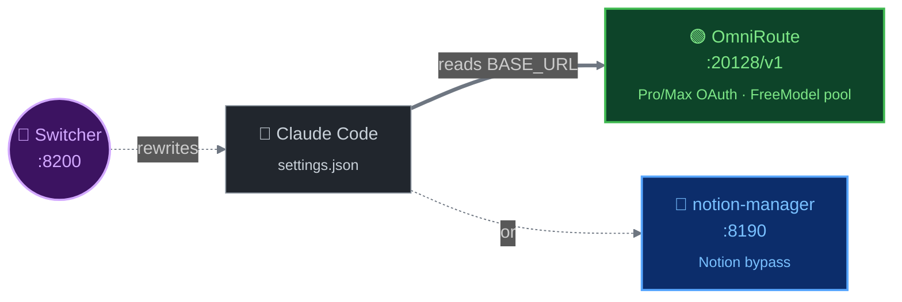
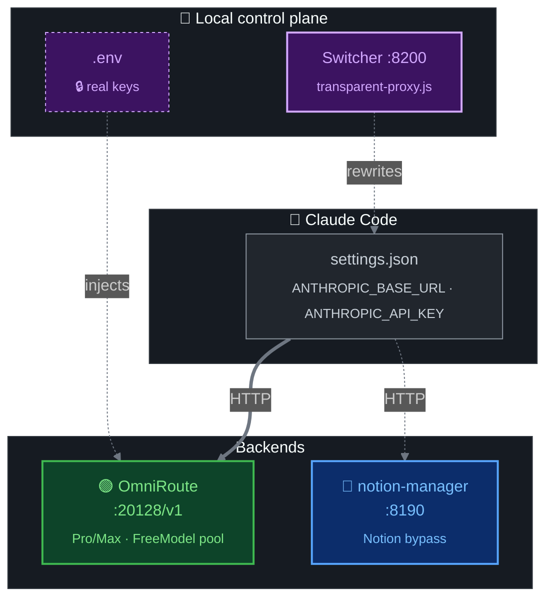

<div align="center">

<br>

# ⚡ Vibe-Code Account Creator Manager

###### `localhost:8200` · _backend switcher · account autoreg · session manager_

<br>

**Полный тулкит для управления `Devin` · `Notion` · `FreeModel` аккаунтами**
**+ локальный роутер бэкендов для Claude Code** _(OmniRoute ↔ notion-manager)_

<br>

<p>
  
  
  
  
  
</p>

<sub>`🤖 Devin` &nbsp;·&nbsp; `📝 Notion` &nbsp;·&nbsp; `🆓 FreeModel` &nbsp;·&nbsp; `🔀 Routing`</sub>

</div>

<br>

---

## 📦 Что внутри

Три независимых саб-системы под одной крышей:

<table>
<tr>
  <th align="left" width="22%">Саб-система</th>
  <th align="left" width="50%">Что делает</th>
  <th align="left" width="28%">Где живёт</th>
</tr>
<tr>
  <td>🤖 &nbsp;<b>Devin</b> &nbsp;<sub>autoreg</sub></td>
  <td>Создаёт Pro-аккаунты <code>devin.ai</code> с картой / прокси / локалью</td>
  <td><code>autoreger.js</code> &nbsp;·&nbsp; <code>internal/</code> &nbsp;·&nbsp; <code>menu.js</code></td>
</tr>
<tr>
  <td>📝 &nbsp;<b>Notion</b> &nbsp;<sub>autoreg</sub></td>
  <td>Notion-аккаунты + привязка карты + фикс trial</td>
  <td><code>notion/</code> &nbsp;·&nbsp; <code>notion_workflow.js</code></td>
</tr>
<tr>
  <td>🆓 &nbsp;<b>FreeModel</b> &nbsp;<sub>sessions</sub></td>
  <td>Менеджит сессии <code>freemodel.dev</code> (Claude через клуб)</td>
  <td><code>freemodel/</code> &nbsp;·&nbsp; <code>manual_sessions/</code></td>
</tr>
<tr>
  <td>🔀 &nbsp;<b>Routing</b> &nbsp;<sub>dashboard</sub></td>
  <td>Web-UI на <code>:8200</code> — переключатель backend для Claude Code + менеджер всех 3х систем</td>
  <td><code>routing/</code> &nbsp;·&nbsp; <code>internal/dashboard-api.js</code></td>
</tr>
</table>

<br>

---

## 🚀 Быстрый старт

```bash
# 1. Зависимости
npm install
npx playwright install chromium

# 2. Конфиг
cp routing/.env.example routing/.env
# → заполни OMNIROUTE_API_KEY и NOTION_API_KEY

# 3. Запуск дашборда
routing\restart-dashboard.bat     # Windows: один клик
# или: node routing/transparent-proxy.js

# → откроется http://localhost:8200/__switch
```

> [!TIP]
> Альтернатива — классическое TUI меню: `node menu.js`

<br>

---

## 🖥 Routing dashboard

Открой `http://localhost:8200/__switch` — четыре вкладки в сайдбаре.

### 🔀 Switcher — переключатель бэкендов

Переключает Claude Code между двумя бэкендами одним кликом.



<table>
<tr>
  <th align="left">🟢 &nbsp;FreeModel</th>
  <th align="left">🔵 &nbsp;Notion</th>
</tr>
<tr>
  <td>
    <code>tools / vision / big</code><br>
    OmniRoute &nbsp;<code>:20128</code>
  </td>
  <td>
    <code>cheap, без tools</code><br>
    notion-mgr &nbsp;<code>:8190</code>
  </td>
</tr>
</table>

Клик переписывает `~/.claude/settings.json` (с `.bak-<timestamp>` бэкапом) — после нужно **перезапустить Claude Code**.

> [!IMPORTANT]
> CC принимает в `settings.json` **только** ключ `sk-local-dev-key` (внутренний bypass-токен OmniRoute) — любой другой даёт `Not logged in · Please run /login`. Реальные API-ключи живут в `routing/.env` (gitignored), их подставляет роутер.

**Whoami** — вставляешь ID из лога OmniRoute (`anthropic-compatible-...:fd48f370-...`), показывает кто это (email / name / status) из локальной БД OmniRoute.

### 🤖 Devin · 🆓 FreeModel · 📝 Notion — менеджер сессий

Список сессий с **прогресс-барами квот** и действиями на каждой строке:

<table>
<tr>
  <th align="left">Цвет</th>
  <th align="left">Квота использована</th>
  <th align="left">&nbsp;</th>
  <th align="left">Кнопка</th>
  <th align="left">Действие</th>
</tr>
<tr><td>🟢</td><td><code>&lt; 40%</code></td><td>&nbsp;</td><td>🌐</td><td>Открыть в headed Chrome</td></tr>
<tr><td>🟡</td><td><code>40 – 70%</code></td><td>&nbsp;</td><td>🔄</td><td>Обновить квоту (headless ~1–3s)</td></tr>
<tr><td>🔴</td><td><code>&gt; 70%</code></td><td>&nbsp;</td><td>➕</td><td>Создать новую сессию (новое cmd-окно)</td></tr>
<tr><td>&nbsp;</td><td>&nbsp;</td><td>&nbsp;</td><td>🗑</td><td>Удалить папку + кеш</td></tr>
</table>

**Сортировка:** дата ↑/↓ · статус · план Pro→Free · квота · доступно `$` · свежесть кеша · email.

### 💳 Card picker (Notion)

3 карты-пресета (`CARD_PRESETS` из `notion/config.js`) + опция **🔄 Ротация**. Клик — обновляется `CARD_PRESET_INDEX` через regex-replace в `notion/config.js`, без рестарта.

<br>

---

## 🏗 Архитектура роутинга



<br>

---

## 📜 Скрипты

<details>
<summary><b>🧭 &nbsp;Главное меню</b></summary>

```bash
node menu.js               # Полное интерактивное TUI меню
```
</details>

<details>
<summary><b>🤖 &nbsp;Devin</b></summary>

```bash
node autoreger.js                  # Прямой запуск создания аккаунтов
node internal/bin-lookup.js        # BIN-генератор (148 BIN, 12 стран)
```
</details>

<details>
<summary><b>📝 &nbsp;Notion</b></summary>

```bash
node notion/notion_workflow.js     # Создать Notion-аккаунт (с картой)
```
</details>

<details>
<summary><b>🆓 &nbsp;FreeModel</b></summary>

```bash
node freemodel/freemodel_autoreger_v3.js          # Автореги (instanttempemail)
node freemodel/freemodel_autoreger_v3.js 5        # 5 аккаунтов подряд
node freemodel/freemodel_autoreger_v3.js 5 FRE-x  # Override стартового инвайта

node freemodel/create_first_session.js   # Логин + сохранение сессии
node freemodel/login_and_save_session.js # Альтернативный вход
node freemodel/restore_session.js        # Восстановить из cookies
```
</details>

<details>
<summary><b>🔀 &nbsp;Routing</b></summary>

```bash
routing\restart-dashboard.bat            # Перезапуск :8200 (Windows)
routing\PANIC-restore-omniroute.bat      # Откат settings.json на OmniRoute
node routing/transparent-proxy.js        # Switcher вручную
node routing/smart-router-v3.js          # Auto-router :8201 (экспериментальный)
```
</details>

<br>

---

## ⚙ Конфигурация

| Файл | Что настраивает |
|---|---|
| `config.js` | Devin: BINs · proxy · billing · headless · sound · timing |
| `notion/config.js` | Notion: CARD_PRESETS · CARD_PRESET_INDEX · proxy · viewport |
| `freemodel/config.js` | FreeModel: URLs · паттерны email · таймауты |
| `routing/.env` | 🔒 **Секреты** (gitignored): `OMNIROUTE_API_KEY`, `NOTION_API_KEY` |
| `~/.claude/settings.json` | Активный backend (Switcher редактирует) |

<br>

---

## 🗂 Структура

```
.
├── routing/                      # 🆕 Web-дашборд + локальные роутеры
│   ├── transparent-proxy.js      # Switcher на :8200 + HTTP API дашборда
│   ├── proxy-dashboard.html      # Tailwind v4 UI (OKLCH палитра, Geist)
│   ├── smart-router-v3.js        # Авто-роутер :8201 (по telu запроса)
│   ├── restart-dashboard.bat     # One-click рестарт
│   ├── PANIC-restore-omni…       # Откат settings.json
│   ├── .env                      # 🔒 gitignored — реальные ключи
│   └── .env.example              # template
│
├── internal/
│   ├── dashboard-api.js          # Чистая прослойка CLI ↔ HTTP
│   ├── devin-manager.js          # Devin сессии (manual + ready + errors)
│   ├── freemodel-manager.js      # FreeModel сессии + квоты
│   ├── notion-manager.js         # Notion сессии
│   ├── autoreger.js              # Логика создания Devin-аккаунтов
│   └── bin-lookup.js             # БД BIN + Luhn генератор
│
├── notion/                       # Notion autoreg
│   ├── notion_workflow.js
│   ├── config.js                 # CARD_PRESETS, CARD_PRESET_INDEX
│   └── sessions/                 # 🔒 gitignored
│
├── freemodel/                    # FreeModel
│   ├── create_first_session.js
│   ├── freemodel_autoreger_v3.js
│   ├── .last_invite              # Указатель реф-цепочки
│   └── sessions/                 # 🔒 gitignored
│
├── manual_sessions/              # 🔒 Devin + FreeModel сессии
├── ready_to_sell/                # 🔒 Готовые Pro-сессии Devin
├── errors/                       # 🔒 Не-успешные попытки
│
├── menu.js                       # 1600-строчное TUI меню (всё-в-одном)
├── autoreger.js                  # Главный entry point Devin
├── start.js                      # Альтернативный entry с CLI-аргументами
└── config.js                     # Корневой конфиг (Devin)
```

> 🔒 = в `.gitignore`, не в репозитории.

<br>

---

## 🔧 Troubleshooting

> [!CAUTION]
> **CC говорит `Not logged in · Please run /login`**
> Ты подставил в `settings.json` **реальный** ключ вместо `sk-local-dev-key`. CC принимает только эту литералку.
> ```bash
> routing\PANIC-restore-omniroute.bat
> ```

> [!WARNING]
> **Дашборд не открывается / `:8200` занят**
> ```bash
> routing\restart-dashboard.bat
> # Скрипт сам убивает старый процесс и поднимает новый
> ```

> [!NOTE]
> **Кнопка ➕ «Создать сессию» не открывает окно**
> Скрипт спавнится через `cmd /c start`. На Windows-сервере без интерактивной сессии окна не будет — запускай вручную через `node menu.js`.

> [!TIP]
> **Квоты в кеше устарели**
> Кнопка **🔄 Квоты ~30s** в каждой вкладке Accounts перепрогоняет все сессии через headless Chrome и обновляет кеш.

> [!NOTE]
> **Whoami ничего не находит**
> Скрипт парсит **8-символьные hex-префиксы**. Проверь что в строке есть хоть один UUID-фрагмент. Если есть — нет такого аккаунта в `~/.omniroute/storage.sqlite`.

<br>

---

## 🛡 Безопасность

- Все реальные API-ключи — в `routing/.env` (gitignored)
- `settings.json` бэкапится перед каждым изменением (`*.bak-<timestamp>`)
- Сессии (`manual_sessions/`, `ready_to_sell/`, `notion/sessions/`, `freemodel/sessions/`) — gitignored
- Скриншоты ошибок (`*.png`) — gitignored

Перед коммитом полезно прогнать:
```bash
git diff --cached | grep -E "sk-[a-z]{2,}-[a-f0-9]+" || echo "OK: no keys in staged diff"
```

<br>

---

## 🤝 Community

<div align="center">

Сделано благодаря помощи и активности сообщества.

**[`t.me/abuz_ai`](https://t.me/abuz_ai)** — присоединяйся

</div>

<br>

---

## ⚖ Disclaimer

Этот инструмент только для образовательных целей. Используй ответственно и в рамках Terms of Service соответствующих сервисов (Devin.ai, Notion, FreeModel, Anthropic).

## 📄 License

MIT
