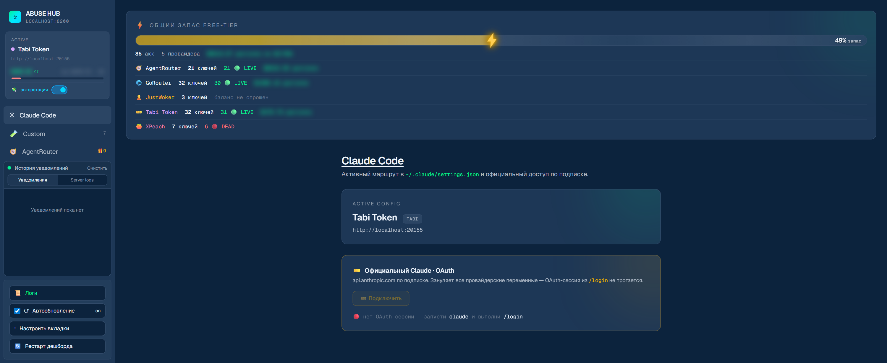
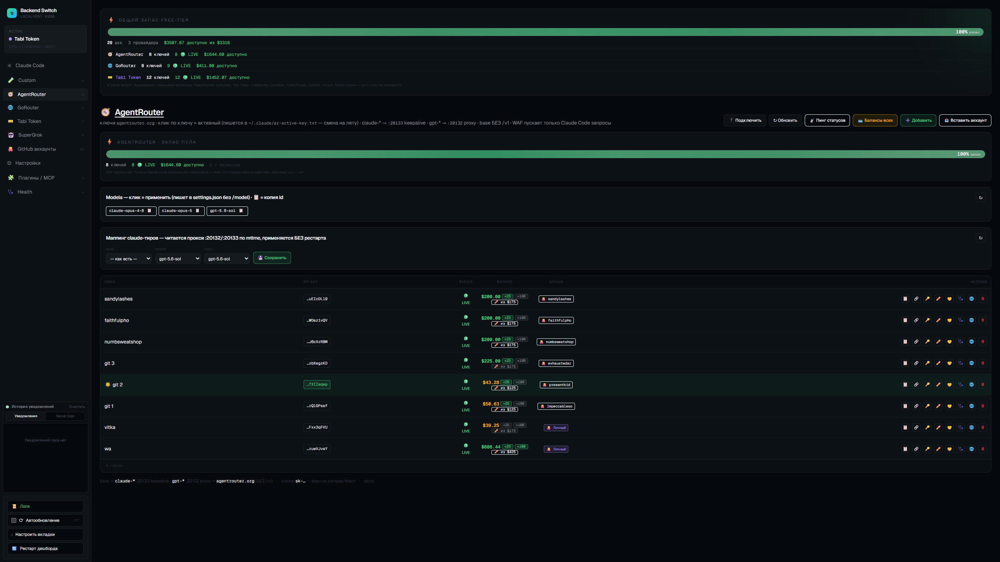
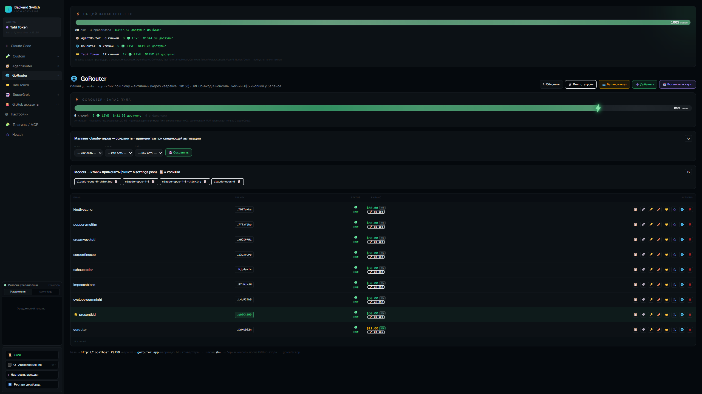
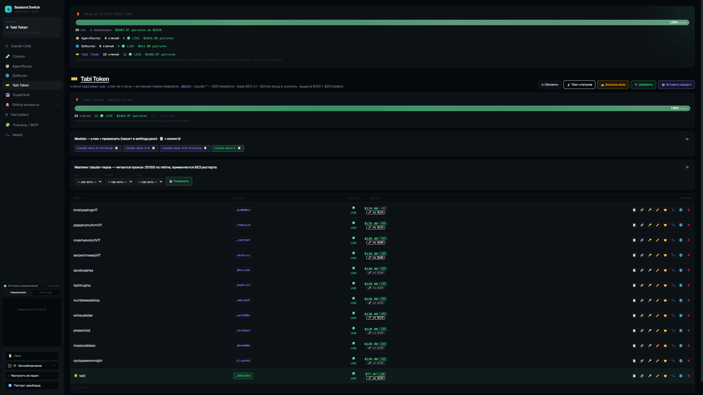

<div align="center">

<a href="https://t.me/xgateonline_bot?start=github"></a>

[](https://t.me/xgateonline_bot?start=github)
[](https://cabinet.xgate.online)
[](https://t.me/xgateonline_bot?start=github)

<sub>Проект бесплатный и живёт с подписок <b>XGATE</b>: свои ноды, IP без истории абуза — регистрации, капчи и API проходят. Промокод <code>ABUSEHUB</code> — 3 дня бесплатно, дальше от 150 ₽/мес.<br>
🤖 <a href="https://t.me/xgateonline_bot?start=github"><b>Telegram-бот @xgateonline_bot</b></a> · 🔑 <a href="https://cabinet.xgate.online"><b>Личный кабинет cabinet.xgate.online</b></a> · <a href="#поддержать-проект">зачем это в репозитории</a></sub>

<br>

# Vibe-Code Account Creator Manager

Локальная control-plane: переключение backend'а Claude Code между провайдерами (**AgentRouter · GoRouter · Tabi Token**) одним кликом из веб-дашборда, автореги/импорт ключей, GitHub-аккаунты с 2FA, статус-лайн с балансом и контекстом. Плюс ТГ-пульт для управления с телефона.

<sub>⚡ <b>Ставится одной строкой на голую машину</b> — <a href="#windows">Windows (PowerShell)</a> · <a href="#macos">macOS (Терминал)</a>. Вставил, пожал Enter — дашборд открылся.</sub>

<br>



<br>

</div>

## Что это

Всё под одной крышей: автореги + веб-дашборд на `:8200` (`routing/transparent-proxy.js`), который переписывает `~/.claude/settings.json` и менеджит пулы ключей. Claude Code читает из `settings.json` `ANTHROPIC_BASE_URL` + ключ — переключение бэкенда = подмена этих полей.

Три актуальных провайдера — **AgentRouter**, **GoRouter**, **Tabi Token** — ходят через локальные **SSE keepalive-прокси** (`routing/keepalive-proxy.js`), которые держат SSE-поток и режут `[1m]`-суффиксы моделей. WAF-провайдеры (AgentRouter) пускают только «настоящие» запросы Claude Code, поэтому ключ пишется литералом в `ANTHROPIC_AUTH_TOKEN`, а баланс каждого ключа дашборд считает сам (`grant + bonus − spent`) и кеширует в `*-sessions.json`.

Фишка: **статус-лайн Claude Code** (`routing/statusline-autoreger.sh`) показывает внизу CLI живой баланс активного ключа (`$`) и контекстное окно (`⧉`), при устаревшем кеше сам дёргает рефреш через дашборд. Установщик подключает его сам; на готовой установке — `node tools/enable-statusline.js` и перезапуск `claude`.

Работает на **Windows и macOS** одинаково: точный баланс, статус-лайн, ЛК в браузере, переключение бэкендов. Мак-специфика (своя схема шифрования куки Chromium, BSD-утилиты) уже учтена в коде — см. [`docs/MAC-SETUP.md`](docs/MAC-SETUP.md).

<div align="center">

### Активные провайдеры

| Модуль | Что делает |
| :--- | :--- |
| **AgentRouter** | Пул ключей `agentrouter.org`. WAF пускает только Claude Code. `claude-*` → keepalive `:20133`, `gpt-*` → конвертер `:20132`. Маппинг claude-тиров, баланс (`grant+bonus+referral−spent`), чек-ин «+25»/рефка «+100», вход в ЛК через GitHub. |
| **GoRouter** | Пул ключей `gorouter.app`. Активация через SSE keepalive `:20156`. GitHub-вход, share/import, баланс (`grant+bonus−spent`, чек-ин «+5»). |
| **Tabi Token** | Пул ключей `tabitoken.com`. Активация через SSE keepalive `:20155`. GitHub-вход, share/import, баланс (`grant+bonus−spent`). |
| **GitHub аккаунты** | Хранилище купленных аккаунтов: логин/пароль/2FA-секрет/recovery/ник, **TOTP локально в браузере** (RFC 6238), профиль браузера на аккаунт, показ секретов через меню. |
| **Health** | Что запущено и что упало: процессы, git-состояние, сервисы/порты. |
| **Claude Code** | Активный маршрут в `settings.json` + подключение официального Claude по OAuth (зануляет провайдерские переменные). |

### Легаси (вкладки в дашборде ещё есть, не развиваются)

| Модуль | Статус |
| :--- | :--- |
| **FreeModel** | сессии + квоты + авто-ротация |
| **VyceAI · Custom** | OpenAI-совместимые пулы через локальные прокси |
| **Aerolink · Cun · Evomap · Ourtoken · Conduit · Svrtr · HelpCoder** | ручные пулы ключей, API Helper |
| **AnyModel · SuperGrok** | автореги/сессии сторонних моделей |
| **Video / Картинки API** | CRUD-хранилища ключей провайдеров |
| **Telegram-пульт** (`tgbot/`) | управление дашбордом с телефона |
| _Архив_ | OmniRoute · TokenRouter · Notion · Devin — «чтим память» |

</div>

Подробная карта модулей, портов и внутренностей — в **[ARCHITECTURE.md](ARCHITECTURE.md)**.

## Сервисы и порты

| Порт | Сервис | Файл |
| :--- | :--- | :--- |
| `8200` | **Dashboard** — UI `/__switch` + все `/__switch/api/*` | `routing/transparent-proxy.js` |
| `20133` | **AgentRouter keepalive** (SSE, claude-*) | `routing/keepalive-proxy.js` |
| `20132` | **AgentRouter proxy** (gpt-* → Anthropic→OpenAI конвертер) | `routing/agentrouter-proxy.js` |
| `20155` | **Tabi Token keepalive** (SSE) | `routing/keepalive-proxy.js` |
| `20156` | **GoRouter keepalive** (SSE) | `routing/keepalive-proxy.js` |
| `20150–20250` | **Custom OpenAI proxies** (динамически, на активацию) | `routing/custom-openai-proxy.js` |
| `20126` | FreeModel Key Rotator *(легаси)* | `routing/freemodel-rotator.js` |
| `20130` | FreeModel OpenAI Proxy *(легаси)* | `routing/freemodel-openai-proxy.js` |
| `20131` | VyceAI OpenAI Proxy *(легаси)* | `routing/vyceai-openai-proxy.js` |
| `20128` | OmniRoute (внешний Docker, опц., *архив*) | docker `ghcr.io/diegosouzapw/omniroute` |
| `8190` | Notion manager *(архив)* | `notion/` |
| — | **Telegram-пульт** — long-poll, порт не слушает | `tgbot/bot.js` |

---

## Установка с нуля

### Windows

Голый Windows, где **нет ни git, ни node** — открой **PowerShell** (есть в любой Windows) и вставь одну строку. Bootstrap сам поставит Git + Node.js через winget, склонирует репо и запустит интерактивный установщик.

```powershell
irm https://raw.githubusercontent.com/WormAlien/vibe-code-account-creator-manager/master/install.ps1 | iex
```

> [!NOTE]
> Если после установки Git появилась ошибка про `bash` — закрой это окно PowerShell, **открой новое** и вставь строку ещё раз (PATH обновляется только в новой сессии). Со второго запуска git/node уже на месте, дойдёт до конца.

### macOS

Голый мак, где нет вообще ничего — открой **Терминал** и вставь **одну строку**. Дальше только Enter: bootstrap ставит Command Line Tools (в них git), клонирует репо и прогоняет `install-mac.sh` — Homebrew → node → `npm install` → Playwright chromium → Claude Code → конфиги из `*.example` → дашборд.

```bash
/bin/bash -c "$(curl -fsSL https://raw.githubusercontent.com/WormAlien/vibe-code-account-creator-manager/master/install-mac.sh)"
```

Хочешь в свою папку — задай `VCACM_DIR` (сама папка станет корнем репо, промежуточные создадутся):

```bash
VCACM_DIR="$HOME/Documents/VibeCode" /bin/bash -c "$(curl -fsSL https://raw.githubusercontent.com/WormAlien/vibe-code-account-creator-manager/master/install-mac.sh)"
```

Проверено на чистом MacBook: одна вставка, дальше Enter — и дашборд открыт. Реагировать надо всего в трёх местах:

1. **Окно «Установить инструменты разработчика»** → **Установить**, подождать 5–10 минут, вернуться в Терминал и нажать **Enter** (скрипт ждёт именно этого).
2. **Пароль от мака** — просит установщик Homebrew через `sudo`. Вводится слепо, символы не показываются — это нормально.
3. **«Терминал» запрашивает доступ к папке «Документы»** (только если ставишь в `Documents`) → **OK**. Промахнулся и нажал «Запретить» — *Системные настройки → Конфиденциальность и безопасность → Файлы и папки → Терминал*.

> [!IMPORTANT]
> Именно `/bin/bash -c "$(curl …)"`, а не `curl … | bash`. При пайпе stdin занят самим скриптом, и интерактивные вопросы («дождись Command Line Tools», «запустить дашборд?») читают тело скрипта вместо твоего ответа. Так же бутстрапится сам Homebrew.

> [!NOTE]
> Папку `Documents` писать латиницей, хотя Finder показывает «Документы» — на диске она английская.

Дальше запуск в любой момент: двойной клик на **`DASHBOARD.command`** в корне репо либо `bash routing/restart-dashboard.sh`. Дашборд: <http://localhost:8200/__switch>

Как это устроено (shim-ы Windows-команд, что работает и что не портировано — автореги Camoufox и ТГ-пульт) — [`docs/MAC-SETUP.md`](docs/MAC-SETUP.md).

### Если git и node уже стоят

Windows (git-bash):

```bash
git clone https://github.com/WormAlien/vibe-code-account-creator-manager.git
cd vibe-code-account-creator-manager
bash install.sh
```

macOS — то же, но `bash install-mac.sh`.

Что делает установщик (всё интерактивно, Enter = дефолт):

1. Проверяет `node`/`npm`/`git`, при нехватке предлагает поставить через `winget`.
2. `npm install` + (опц.) `npx playwright install chromium`.
3. Ставит **Claude Code**, если его нет. Уже установленную версию не трогает (версию фиксировать не надо; если зачем-то нужна конкретная — `CLAUDE_CODE_VERSION=2.1.153 bash install.sh`).
4. Создаёт `~/.claude/settings.json` из шаблона (если ещё нет).
5. Копирует локальные конфиги из `*.example` (`routing/.env`, `al-sessions`, `video-keys`, `image-keys`).
6. **OmniRoute** в Docker (по желанию) на `:20128`; без Docker можно жить на API Helper-бэкендах.
7. **ТГ-бот** (по желанию) — спросит токен и whitelist, запишет в `tgbot/.env`.
8. Python-зависимости (по желанию) — Camoufox + venv для ✈ Открыть TG. Установщик предпочитает Python 3.11; на 3.12 предупредит про Visual C++ Build Tools.
9. Запускает дашборд.

Установщик дополнительно ловит частую ошибку `vibe-code-account-creator-manager/vibe-code-account-creator-manager`: такую двойную вложенность надо исправить **до** создания `tools/tg-venv`, иначе venv запомнит старый путь и сломается после переноса папки.

**Дашборд:** <http://localhost:8200/__switch> · откат при поломке ключа: `routing/PANIC-restore-omniroute.bat`

> [!TIP]
> **Дашборд не открылся / `:8200` не отвечает?** Запусти **`START.bat`** в корне репо (двойной клик). Он поднимает ротатор + дашборд в видимом окне и **не закрывается** — если что-то падает, текст ошибки останется на экране, сделай скриншот и пришли. Браузер откроется сам на `http://localhost:8200/__switch`.

> [!IMPORTANT]
> **Версию Claude Code фиксировать не надо.** Исторически в README и установщике стоял пин `2.1.153` («новее ломает `apiKeyHelper`») — это не подтвердилось: ротация ключей на лету работает на всех версиях. Установщик ставит CC только если его нет, уже стоящий не трогает, `DISABLE_AUTOUPDATER`/`autoUpdates:false` из шаблона убраны. Единственное, что реально нужно для `apihelper`/`aerolink`, — `CLAUDE_CODE_API_KEY_HELPER_TTL_MS=0`, чтобы ключ перечитывался на каждый запрос.

<details>
<summary><b>Вручную, без установщика</b> — те же шаги командами (git-bash)</summary>

```bash
# 0. системные зависимости (winget)
winget install OpenJS.NodeJS.LTS          # Node.js LTS (>=18) + npm
winget install Git.Git                     # Git for Windows (git-bash)
winget install Docker.DockerDesktop        # опц.: только под backend OmniRoute
winget install Python.Python.3.11          # опц.: стабильнее для opentele/tgcrypto
# Если остаёшься на Python 3.12 и tgcrypto собирается из исходников:
winget install -e --id Microsoft.VisualStudio.2022.BuildTools --override "--wait --add Microsoft.VisualStudio.Workload.VCTools --includeRecommended"

# 1. зависимости
npm install
npx playwright install chromium

# 2. Claude Code (любая свежая версия, пин не нужен)
npm config delete prefix
npm install -g @anthropic-ai/claude-code

# 3. базовый settings.json (для apihelper/aerolink важен CLAUDE_CODE_API_KEY_HELPER_TTL_MS=0)
cp claude-settings.example.json ~/.claude/settings.json

# 4. локальные конфиги/секреты (gitignored)
cp routing/.env.example             routing/.env
cp routing/al-sessions.example.json routing/al-sessions.json
cp routing/video-keys.example.json  routing/video-keys.json
cp routing/image-keys.example.json  routing/image-keys.json
cp tgbot/.env.example               tgbot/.env   # впиши BOT_TOKEN + ALLOWED_USERS

# 5. OmniRoute (Docker) — опционально, нужен только если хочешь backend OmniRoute
MSYS_NO_PATHCONV=1 docker run -d --name omniroute \
  -p 20128:20128 -v omniroute-data:/app/data --restart unless-stopped \
  -e PORT=20128 -e HOSTNAME=0.0.0.0 ghcr.io/diegosouzapw/omniroute:latest

# 6. опц. Python-зависимости (✈ Открыть TG)
py -3.11 -m venv tools/tg-venv
tools/tg-venv/Scripts/pip install -r tools/tg-venv-requirements.txt

# 7. запуск
routing/restart-dashboard.bat              # keepalive-прокси + дашборд :8200 + откроет UI
npm run tgbot                              # опц.: ТГ-пульт
```
</details>

---

## Дашборд

`http://localhost:8200/__switch`. Сайдбар: **Health · Claude Code · FreeModel · VyceAI · Aerolink · Cun · Evomap · Ourtoken · Custom · Conduit · Svrtr · HelpCoder · AgentRouter · GoRouter · Tabi Token · GitHub аккаунты · AnyModel · Video API · Картинки API · SuperGrok · Плагины / MCP · Настройки** (+ архив «Чтим память»: TokenRouter · Devin · Notion). Порядок и видимость настраиваются кнопкой **⋮ Настроить вкладки**.

Активные вкладки — **AgentRouter · GoRouter · Tabi Token · GitHub аккаунты**. Остальные провайдеры — легаси (см. таблицу выше).

### Claude Code

Главная вкладка: активный маршрут из `~/.claude/settings.json` (имя + base URL + режим) и кнопка **🎫 Подключить** — официальный Claude по OAuth (`api.anthropic.com`, не трогает `/login`-сессию).

### AgentRouter

Пул ключей `agentrouter.org`. **WAF пускает только реальный Claude Code**: probe/models обязаны нести CC-заголовки, `apiKeyHelper` не работает — ключ пишется литералом в `ANTHROPIC_AUTH_TOKEN` (base `https://agentrouter.org` БЕЗ `/v1`).

- **Маршрутизация моделей** — клик по модели = полная настройка Claude Code в один клик: `~/.claude/ar-active-model.txt` + `settings.model` + base + токен + оба прокси. Всё идёт в SSE keepalive `:20133`, он форвардит `claude-*` в agentrouter.org и переправляет `gpt-*` в конвертер `:20132` (Anthropic→OpenAI). После клика нужен рестарт Claude Code — `/model` вводить не надо.
- **Маппинг claude-тиров** — блок «Маппинг claude-тиров»: `opus`/`sonnet`/`haiku` → модель agentrouter (`routing/ar-modelmap.json`). Применяется прокси/keepalive на каждый запрос по mtime (БЕЗ рестарта). Закрывает сабагентов (у agentrouter своих haiku-моделей нет); пустой тир = не маппить. Клик по чипу модели маппинг не трогает.
- **Баланс** — сервис отдаёт только `total_usage` (центы), выдача угадывается по шагу $25 (`max(175, …)`). `balance = grant + bonus + referral − spent`. Кнопки **«+25»** (чек-ин в ЛК) и **«+100»** (реферал), **✏️ из $X** — ручная выдача, **💳 Балансы всех** — пакетный прогон.
- **🌐 ЛК** — браузер аккаунта (видимый Chromium, персональный профиль `agentrouter/profiles/<label>/`). Ключа у аккаунта ещё нет → открывается **регистрация по реф-ссылке** владельца репо; ключ уже вписан → `agentrouter.org/console/topup` (там же чек-ин). Аккаунт можно добавить **без ключа** (поле `api_key` пустым): в списке он помечен «🔑 получи API-ключ после регистрации» / `⚪ нет ключа`, активация и пинг у него выключены, а 🌐 сразу открывает регистрацию. Ключ вписывается потом кнопкой 🔑.
- **Два фильтра, не путать.** **WAF** смотрит на заголовки (`user-agent: claude-cli/…` → 200, `curl` → `401 unauthorized client detected`) — оба прокси подставляют CC-заголовки. **Content-filter** смотрит на текст и только на gpt-пути: режет точную подстроку `you are a helpful assistant.` (с точкой!) → `500 sensitive words detected`. Из-за этого `/model gpt-5.6-sol` падал детерминированно — пробник валидации модели у CC шлёт ровно эту фразу. Лечится `WAF_PHRASES`/`wafSanitize` в `agentrouter-proxy.js` (правка на сериализованном теле + лог срабатывания). **Base64-картинки — второй блокер (2026-08-18)**: любой base64-образ в теле (image_url от конвертера или блоб `/9j/…`/`iVBOR…` в tool_result) → `400 content-blocked`, из-за этого сессии с тулами-скриншотами падали каждым запросом (7.5МБ из 7.7МБ корпуса — это картинки). Режется `IMAGE_B64_RE` в `wafSanitize`: data-url → валидная 1x1 PNG, сырой блоб → `[image omitted]` (реальный 12МБ-дамп → 499КБ → 200). Старый Cyrillic-bypass (`c→с`) отключён флагом `CYR_BYPASS_ENABLED=false` — с 2026-08-15 WAF сам режет хомоглифы (`400 content-blocked`), а чистую латиницу пропускает.



### GoRouter

Пул ключей `gorouter.app`. GitHub-вход в консоль, **активация через SSE keepalive `:20156`** (`routing/keepalive-proxy.js` → gorouter.app: режет `[1m]`, count_tokens fallback, держит SSE-паузы thinking-моделей).

- **Баланс** — как у AgentRouter, но шаг бонуса **$5**: `balance = grant + bonus − spent`, кнопка **«+5»** (чек-ин), **✏️** — ручная выдача. База выдачи `GO_DEFAULT_GRANT = 70`.
- **Маппинг claude-тиров** — `routing/gorouter-modelmap.json` (по mtime, БЕЗ рестарта).
- **Share / import** — поделиться сессией, вставить аккаунт из буфера.
- **🌐 ЛК** — как у AgentRouter: аккаунт без ключа → регистрация по реф-ссылке, с ключом → `gorouter.app/wallet`.



### Tabi Token

Пул ключей `tabitoken.com`. GitHub-вход, **активация через SSE keepalive `:20155`** (как gorouter).

- **Баланс** — `balance = grant + bonus − spent`. Дефолт выдачи $100, бонус за приведённого по рефке $20. **✏️** — ручная выдача.
- **Маппинг claude-тиров** — `routing/tabi-modelmap.json` (по mtime, БЕЗ рестарта).
- **Share / import** — как у gorouter.
- **🌐 ЛК** — как у AgentRouter: аккаунт без ключа → регистрация по реф-ссылке, с ключом → `tabitoken.com/wallet`.



### GitHub аккаунты

Хранилище купленных аккаунтов GitHub (нужны для чек-ина бонусов AgentRouter/GoRouter/Tabi).

- **Поля** — логин/пароль/2FA-секрет (TOTP)/recovery-коды/ник/`apiToken`/заметка. Показ секретов — через меню (👁/📋), маска по умолчанию.
- **TOTP считается локально в браузере** — base32 + HMAC-SHA1 (RFC 6238), обратный отсчёт 30с, без внешних сервисов.
- **Профиль браузера на аккаунт** — клик «🌐» открывает Chromium с персональным профилем `github/profiles/<id>/` (сохраняет GitHub-сессию).
- **Импорт форматов** — пачкой (логин:пароль:секрет и т.п.), статусы live/cooldown/dead вручную.

### Health

Что запущено и что упало: wired-процессы, git-состояние репо, сервисы по портам. Клик по строке = детальнее.

### Плагины / MCP

Слева — плагины Claude Code (тоггл `enabledPlugins`, **★ Включить рекомендованные**), справа — MCP-серверы из `~/.claude.json` (тоггл через `/api/mcp/*`).

### Настройки

- **Обновление дашборда** — `git pull` + рестарт одной кнопкой.
- **Тоггл статус-бара CC и автокомпакта** — вкл/выкл `statusLine.command` и `autoCompactEnabled` через `/api/settings/apply`.
- **JSON-редактор `settings.json`** + бэкапы (`~/.claude/settings-backups/`, создать/восстановить/удалить).
- **OmniRoute env** — `OMNIROUTE_BASE_URL` + `OMNIROUTE_API_KEY` → `routing/.env`.

---

## Статуслайн Claude Code

Строка внизу CLI: `tabi/claude-sonnet-4-5 │ $93.34 │ ⧉ 139k/1M`. Скрипт — `routing/statusline-autoreger.sh` (прописывается в `statusLine.command`).

- **Баланс `$`** — для AgentRouter / GoRouter / Tabi: читает блок активного ключа из `*-sessions.json` (кеш дашборда), `~` = устаревший кеш; при протухании >90с сам дёргает `GET /__switch/api/{ar,tb,go}/balance` (fire-and-forget) — следующий рендер уже свежий.
- **Контекст `⧉`** — `total_input_tokens/context_window_size` из payload Claude Code; при отсутствии — `⧉ ?`.
- Провайдер определяется по `apiKeyHelper`/`ANTHROPIC_BASE_URL` из `settings.json` без сети.

---

## Легаси (кратко)

Вкладки существуют, но не развиваются. Данные/логика не удалены — см. `ARCHITECTURE.md`:

- **FreeModel** — сессии `freemodel.dev` + квоты (5h/7d, `$`) + авто-ротация ключей через API Helper (`fm-active-key.txt`).
- **Aerolink / Evomap / Ourtoken / Conduit / Svrtr / HelpCoder** — ручные пулы ключей через `apiKeyHelper` + `*-active-key.txt`.
- **VyceAI / Custom** — Anthropic→OpenAI конвертеры (`:20131` / `20150–20250`).
- **Cun** — пул ключей `cun.ai` через `AUTH_TOKEN`.
- **SuperGrok** — сессии grok.com (device-auth через Camoufox).
- **AnyModel** — автореги сторонних моделей.
- **Video / Картинки API** — CRUD-хранилища ключей (NanoBanana, fal, Replicate, Imagen…).
- **Telegram-пульт** (`tgbot/`) — переключение бэкендов с телефона + живая claude-сессия. Команды `/status`, `/backends`, `/cd`, `/pwd`, `/new`, `/stop`. Запуск `npm run tgbot`.

---

## Reference

<details>
<summary><b>Скрипты</b></summary>

```bash
# Dashboard
routing/restart-dashboard.bat            # рестарт keepalive-прокси + дашборда :8200, откроет UI
routing/PANIC-restore-omniroute.bat      # откат settings.json на OmniRoute
node routing/transparent-proxy.js        # дашборд вручную

# ЛК/сессии провайдеров (GitHub-вход, чек-ин бонусов)
node agentrouter/open-session.js <label>  # вход в кабинет AgentRouter (+$25 чек-ин)
node tabi/open-session.js <label>         # вход в кабинет Tabi Token
node gorouter/open-session.js <label>     # вход в кабинет GoRouter
```
</details>

<details>
<summary><b>Структура и конфиги</b></summary>

| Папка / файл | Что |
| :--- | :--- |
| `install.sh` | Интерактивный установщик с нуля |
| `routing/transparent-proxy.js` | Dashboard :8200 + HTTP API + пулы ключей |
| `routing/keepalive-proxy.js` | SSE keepalive для agentrouter :20133 / tabi :20155 / gorouter :20156 (параметризован env: `PORT`/`UPSTREAM`/`KEY_FILE`/`MODELMAP_FILE`) |
| `routing/agentrouter-proxy.js` | AgentRouter gpt-конвертер :20132 (Anthropic→OpenAI) |
| `routing/{agentrouter,gorouter,tabi}-sessions.json` | Пулы ключей + кеш балансов (gitignored) |
| `routing/{ar,gorouter,tabi}-modelmap.json` | Маппинг claude-тиров (редактируется на вкладках) |
| `routing/github-accounts.json` | Хранилище GitHub-аккаунтов: логин/пароль/TOTP/recovery (gitignored) |
| `routing/statusline-autoreger.sh` | Статус-лайн CC: провайдер/модель · $баланс · ⧉ контекст |
| `routing/proxy-dashboard.html` | UI (Tailwind) |
| `agentrouter/` · `tabi/` · `gorouter/` | open-session.js (вход в ЛК), профили браузера |
| `github/` | open-session.js + профили браузеров по id |
| `routing/custom-openai-proxy.js` · `routing/custom-providers.json` | Custom-провайдеры |
| `internal/dashboard-api.js` | Прослойка CLI ↔ HTTP |
| `freemodel/` · `conduit/` · `svrtr/` · `helpcoder/` · `anymodel/` · `vyceai/` | Легаси-провайдеры |
| `tgbot/` | Telegram-пульт (`bot.js` + `.env`) |
| `~/.claude/settings.json` | Активный backend (дашборд редактирует) |
| `~/.claude/{ar,tabi,gorouter}-active-key.txt` · `-active-model.txt` | Активный ключ/модель провайдера |
| `manual_sessions/` · `ready_to_sell/` · `tools/{tg-venv,telegram-portable,tg-profiles}` | _gitignored_ |
| `menu.js` | TUI-меню (всё-в-одном) |

</details>

## Troubleshooting

<table>
<tr><th align="left">Симптом</th><th align="left">Причина / фикс</th></tr>
<tr>
  <td>CC говорит <code>Not logged in · Please run /login</code></td>
  <td>В <code>settings.json</code> попал не тот ключ →&nbsp; <code>routing/PANIC-restore-omniroute.bat</code></td>
</tr>
<tr>
  <td>Статус-бар CC не показывает баланс <code>$</code></td>
  <td>Активный провайдер вне {agentrouter, tabi, gorouter} (у легаси gauge нет) или кеш ещё не заполнен — нажми «💳 Балансы всех» на вкладке провайдера</td>
</tr>
<tr>
  <td>Дашборд не открывается / <code>:8200</code> занят</td>
  <td><code>routing/restart-dashboard.bat</code> — сам убивает старый процесс на :8200</td>
</tr>
<tr>
  <td>AgentRouter: <code>400 content-blocked</code></td>
  <td>WAF режет кириллические хомоглифы (c→с). Чистая латиница проходит — проверь, что не включён <code>CYR_BYPASS_ENABLED</code></td>
</tr>
<tr>
  <td>AgentRouter gpt-модель не отвечает</td>
  <td>Не поднят прокси <code>:20132</code> — выбери gpt-модель заново или подними <code>routing/agentrouter-proxy.js</code></td>
</tr>
<tr>
  <td>Tabi/GoRouter не активируются</td>
  <td>Не работает SSE keepalive <code>:20155</code>/<code>:20156</code> — рестарт дашборда (<code>restart-dashboard.bat</code>) пересоздаёт прокси</td>
</tr>
<tr>
  <td>Ключи не ротируются «на лету» / нужен релогин после свича</td>
  <td>Для <code>apihelper</code>/<code>aerolink</code> проверь <code>CLAUDE_CODE_API_KEY_HELPER_TTL_MS=0</code> в <code>settings.json</code> — без него CC кэширует ключ. Версия CC тут ни при чём</td>
</tr>
</table>

## Безопасность

- Реальные API-ключи/пароли — в `routing/*.json` (gitignored) + `~/.claude/*-active-key.txt`; дашборд маскирует их в UI (👁/📋).
- `settings.json` бэкапится перед каждым изменением (`*.bak-<timestamp>`).
- Gitignored: `routing/.env` · `tgbot/.env` · `routing/*-sessions.json` · `routing/github-accounts.json` · `routing/{video,image}-keys.json` · `~/.claude/*-active-key.txt` · `freemodel/{sessions,tg_pool.json}` · `conduit/accounts/` · `agentrouter/profiles/` · `tabi/{profiles,sessions}/` · `github/profiles/` · `tools/{tg-venv,telegram-portable,tg-profiles}` · `*.png`.

Перед коммитом:

```bash
git diff --cached | grep -E "sk-[a-z]{2,}-[a-f0-9]+|auth_key_hex|fe_oa_|aero_live_|totpSecret|recoveryCodes|ghp_" || echo "OK: no keys in staged diff"
```

## Поддержать проект

Всё здесь бесплатное и таким останется. Если сэкономило тебе время — лучший способ сказать спасибо: взять подписку на **XGATE**, наш VPN. Деньги идут на серверы, автореги и разработку этого репозитория.

<table>
<tr>
  <td>🎟️ <b>Промокод <code>ABUSEHUB</code></b></td>
  <td><b>3 дня бесплатно</b>, карта не нужна — вводится в боте</td>
</tr>
<tr>
  <td>🤖 <b>Telegram-бот</b></td>
  <td><a href="https://t.me/xgateonline_bot?start=github">@xgateonline_bot</a> — покупка, ключи, саппорт</td>
</tr>
<tr>
  <td>🔑 <b>Личный кабинет</b></td>
  <td><a href="https://cabinet.xgate.online">cabinet.xgate.online</a> — подписка, устройства, статистика</td>
</tr>
<tr>
  <td>📄 <b>Документация</b></td>
  <td><a href="https://docs.xgate.online">docs.xgate.online</a> — настройка под iOS/Android/Windows</td>
</tr>
<tr>
  <td>💸 <b>Партнёрка</b></td>
  <td><b>20%</b> с каждого платежа приведённых, пожизненно — ссылка в боте</td>
</tr>
</table>

**Почему это релевантно этому репо.** Регистрации, капчи и API-эндпоинты не любят выжженные IP публичных VPN — с них ловишь бан ещё на форме. У XGATE свой небольшой пул нод (**DE · CH · NL · FI · RU**), а не перепроданный чужой пул: Reality (XTLS), XHTTP за CDN, Hysteria2 — проходит DPI и операторские белые списки. От **150 ₽/мес**, оплата картой и СБП в рублях или криптой, 1–20 устройств на подписку.

## Disclaimer

Образовательные цели. Используй в рамках ToS соответствующих сервисов (AgentRouter, GoRouter, Tabi Token, Anthropic).

## License

MIT
